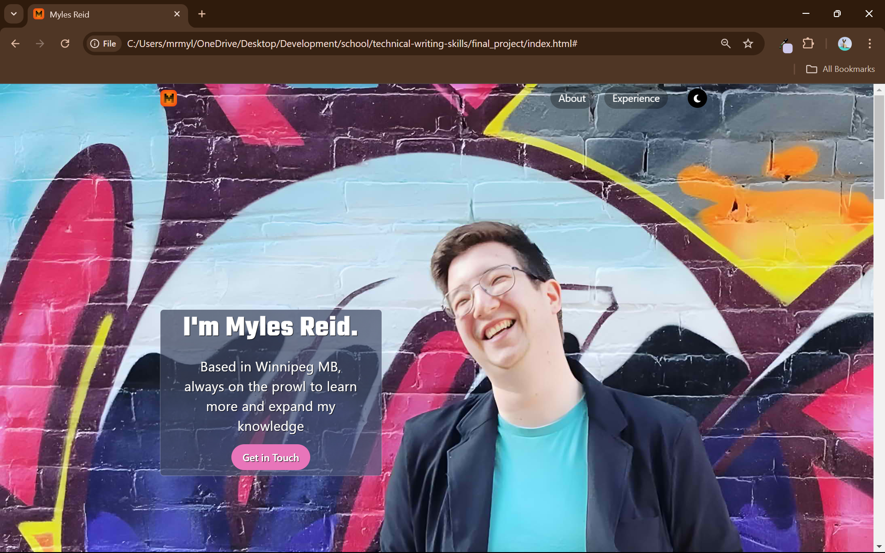

# Portfolio

Hello World! This is a first go around at a portfolio. Its simple, and not too 
exciting, but its a start at least!

---

## Features

- Light/dark mode toggle
- Responsive
- CSS animations with JS triggers
- Small JS tricks!

---

## Lessons Learned

There was a lot of learning happening here, and I'm sure there are more lessons
to come. Some of my biggest challenges was really figuring out how to get the un-even
section divides. After I managed to wrap my brain around it, it all made sense though.

Another challenge was getting the typing text, and having it rotate what was in it.
There is still a little issue that I noticed and am unsure why it happens. When the 
page has been tabbed out, and you tab back into, the words are all jumbled and weird.
I'm sure I'll get to it at some point and really figure it out

---

## Screenshots

---

## Badges

  
   
  

